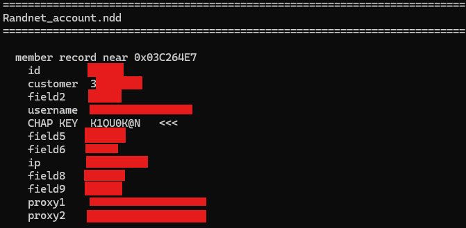
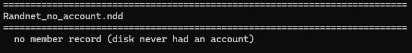
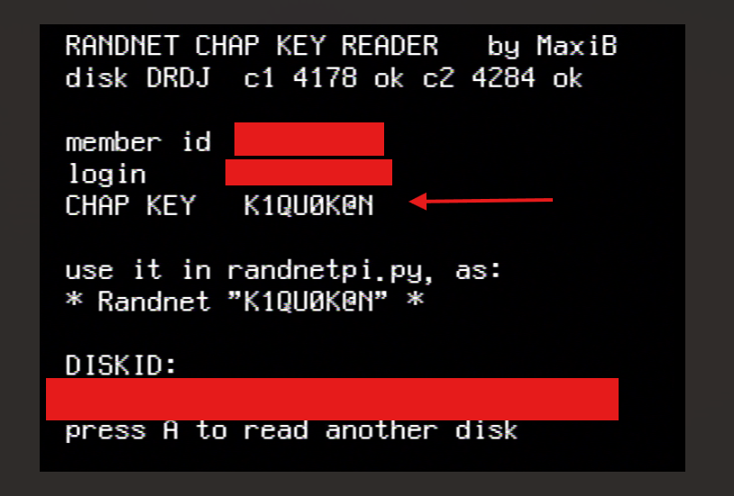
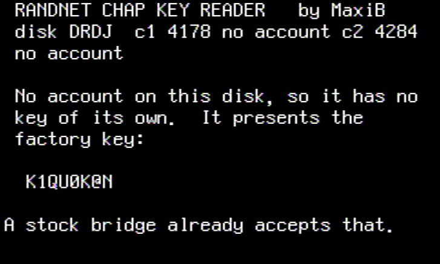

# randnetpi3 — Randnet dial-up bridge

Lets a Nintendo 64 with a NUS-029 modem cartridge dial up and get online again.
A Linux box (a Raspberry Pi is the usual choice) stands in for the phone
network: it answers the console's call, authenticates it over PPP/CHAP, routes
its traffic, and gives the disk's 1999 browser a way to reach today's web.

This work was based on Luigiblood original randnetpi script (https://64dd.org/pi/)

Three services, each doing one job.

| Service | Script | Job |
|---|---|---|
| `randnetpi3` | `randnetpi3.py` | Answer the call, run `pppd`, apply NAT, redirect the Randnet names |
| `randnet-proxy` | `randnet_proxy.py` | Plain HTTP in, HTTPS out, for the disk's browser |
| `stunnel@randnet` | `stunnel-randnet.conf` | Wraps the service traffic in TLS on its way out |

The installer sets up the first two, and the third when asked.

## TL;DR
1) On a Linux distro (a RPi, Ubuntu or Debian), connect a USB Modem.
2) Place all files of this repo in your distro (the `randnet_diskread.n64` is not needed)
3) Run the following command where the files are located: 

```
sudo python3 install_randnetpi3.py --randnet-server dd.randnetdd.ch --with-tls --fix-dnsmasq-conflicts
```

- You can add the parameter `--with-wrp` if your machine is powerful enough to handle the docker image for the wrp (Web Rendering Proxy) (more info at https://github.com/tenox7/wrp)

- `--fix-dnsmasq-conflicts` --> Rewrite an existing dnsmasq setup that would otherwise clash. Safe to include by default.

4) Follow the instructions for the CHAP key on screen

- Note: On Ubuntu, dnsmasq/WRP may lose a race with systemd-resolved on first install; a second run settles it.

## Contents

| File | Purpose |
|---|---|
| `randnetpi3.py` | The dial-up answering service |
| `randnetpi3.conf` | Config template, copied to `/etc/randnetpi3.conf` |
| `randnetpi3.service` | systemd unit for the answering service |
| `randnet_proxy.py` | The browsing proxy |
| `randnet-proxy.service` | systemd unit for the proxy |
| `stunnel-randnet.conf` | TLS tunnel config, copied to `/etc/stunnel/randnet.conf` |
| `install_randnetpi3.py` | Installer: sets everything up and checks it works |
| `set_chap_key.py` | Change the CHAP key after installation |
| `extract_member.py` | Read the member record, including the CHAP key, out of a `.ndd` disk image |
| `randnet_diskread.n64` | N64 ROM that shows the CHAP key from a physical Randnet disk |

## Requirements

- Linux with Python 3.9 or newer
- `pppd`, `iptables`, and `dnsmasq` if the name redirect is used
- `stunnel4`, only for `--with-tls` (the installer pulls it in)
- A serial or USB modem
- `pyserial` — the only third-party Python package

## Installing

```
sudo python3 install_randnetpi3.py --randnet-server dd.randnetdd.ch
```

It checks the system, asks for your CHAP key, writes `/etc/randnetpi3.conf`,
installs the scripts into `/opt/randnetpi3/`, enables the systemd units, and
finishes with a health check that says what is working and what is not.

Omit `--randnet-server` and it will ask. To see what it would do without
changing anything, add `--dry-run`.

| Flag | Effect |
|---|---|
| `--randnet-server ADDR` | Where the Randnet names point. A hostname or an IPv4 address. |
| `--chap-secret KEY` / `--default-key` | Supply the key non-interactively |
| `--with-tls` | Send the service traffic through a TLS tunnel. Needs a hostname. |
| `--tls-port N` | Port the server terminates TLS on (default 443) |
| `--tunnel-port N` | Local port stunnel listens on (default 8443) |
| `--proxy-port N` | Move the browsing proxy off 8080. The NAT rules follow it. |
| `--no-proxy` | Do not install the browsing proxy |
| `--proxy-max-bytes N` | Cap the page size handed to the console (default 32768) |
| `--with-wrp` | Also install WRP, for pages the disk's renderer cannot handle |
| `--skip-dnsmasq` | Leave dnsmasq alone |
| `--dry-run` | Change nothing |

`--help` lists the rest, including the WRP options and the `--fix-*` repair
flags for a machine where dnsmasq or Docker is already configured awkwardly.

Run the installer from the directory holding these files. It uses the
`randnetpi3.py` next to it, not whatever an earlier install left in
`/opt/randnetpi3`, and it will stop with a clear message if the two disagree.

## Finding your CHAP key

The key lives in the member record on the 64DD disk. Every one seen so far is
exactly 8 characters. A disk that has never had an account uses the factory key
`K1QU0K@N`. Any new account created will use that key.

From a disk image:

```
python3 extract_member.py your_disk.ndd
```

Example with an account with the factory key:



Example without account:



Read the value on the `CHAP KEY` line.

From a physical disk, with no PC involved: flash `randnet_diskread.n64` onto a
flash cart, put the Randnet disk in the 64DD, and the ROM prints the key on
screen.

Do this **before** the first dial. Nothing here can recover a key that was
never written down.

Example with an account: 



Example without account:



## Configuration

`/etc/randnetpi3.conf`. Every value in the template is the built-in default, and
an empty value means "work it out at run time", so you can delete anything you
are not changing.

```ini
[modem]
device =            ; e.g. /dev/ttyUSB0, auto-detected when empty
speed = 57600
dial_tone = yes

[ppp]
chap_secret = K1QU0K@N   ; the key from your disk
local_ip =
peer_ip =

[network]
randnet_redirect = host
manage_etc_hosts = yes
randnet_tls = no
```

`randnet_redirect` takes one of:

| Value | Meaning |
|---|---|
| `host` | This machine serves the Randnet names. For a development box. |
| an IPv4 address | The names point there |
| a hostname | Resolved at every service start, so the server can move without this file being edited |
| `off`, `none`, or empty | No redirect; the names resolve upstream |

### Pin the console's address

Set `local_ip` and `peer_ip` to fixed values outside your DHCP pool. Left empty
they are chosen at run time, and the console's address then moves between
sessions as the ARP cache changes.

### The two dnsmasq files

Easy to confuse, and they have different lifetimes:

- `/etc/dnsmasq.d/randnetpi3.conf` — written once by the installer. Holds the
  dnsmasq settings, `bind-dynamic` among them, so dnsmasq starts whether or not
  `ppp0` exists.
- `/etc/dnsmasq.d/randnetpi3-redirect.conf` — rewritten by the service on every
  start. Do not edit it; your changes go away at the next restart.

## The browsing proxy

The disk's browser renders HTML 3.2 well enough but has no usable TLS, and
nothing can be added to it. `randnet_proxy.py` accepts an ordinary HTTP request
from the console, fetches the page over TLS, and hands back plain HTTP. It also
rewrites `https://` to `http://` in HTML bodies, without which the first page of
a site arrives fine and every absolute link on it is a dead end.

Upstream it announces itself as a modern browser, because sites vary their markup
on that and a 1999 identity gets unpredictable results. The exception is
`--preserve-agent-for`, which passes the console's own `User-Agent` through
untouched for the hosts named. The installer sets it for the Randnet domain, so a
server that answers only the console's browser still recognises it through the
proxy.

To run it by hand:

```
python3 randnet_proxy.py --port 8080 --preserve-agent-for randnet.ne.jp
```

`GET /hello` is answered locally, with no DNS and no upstream fetch, so it proves
the TCP and HTTP path on its own:

```
curl http://<bridge-address>:8080/hello
```

A stock proxy such as squid or tinyproxy does not solve this problem. It would
pass the request through unchanged and the console still could not speak TLS.

## The TLS tunnel

The console speaks plain HTTP and always will. That link is point to point into
this machine and never crosses a shared network. What does cross the internet is
the service traffic onward to the Randnet server, and that carries credentials.
`--with-tls` wraps only that segment.

```
console --HTTP--> this machine --TLS--> Randnet server
```

## Day to day

```
journalctl -fu randnetpi3          # the answering service
journalctl -fu randnet-proxy       # the browsing proxy
```

Wait for `Listening for a call` in the journal, then cold boot the console and
dial.

Change the CHAP key:

```
sudo /opt/randnetpi3/set_chap_key.py             # asks
sudo /opt/randnetpi3/set_chap_key.py --show      # print the current key
sudo /opt/randnetpi3/set_chap_key.py --key 'PC#4x!9q'
sudo /opt/randnetpi3/set_chap_key.py --factory   # K1QU0K@N, for a blank disk
```

It backs up the config, writes the key, checks it reads back correctly, and
restarts the service. Any call in progress is dropped.

Check where the Randnet names actually point — the config, the generated drop-in
and the resolver are compared, which is usually enough to find the disagreement:

```
sudo /opt/randnetpi3/randnetpi3.py --check-dns --config /etc/randnetpi3.conf
```

Preview the generated pppd command and NAT rules without touching anything:

```
sudo /opt/randnetpi3/randnetpi3.py --config /etc/randnetpi3.conf --dry-run
```

And where the console is actually trying to connect, which settles most "it just
hangs" questions in one look:

```
sudo tcpdump -i ppp0 -n "tcp[tcpflags] & tcp-syn != 0"
```

## Self-tests

Every script carries offline checks that need no hardware and no root:

```
python3 randnetpi3.py --self-test
python3 randnet_proxy.py --self-test
python3 set_chap_key.py --self-test
python3 install_randnetpi3.py --self-test
```

The installer's suite deliberately prints `ERROR:` lines: those are the cases
that are supposed to be rejected. Only the final summary decides the result.

## Security notes

`randnet_proxy.py` is an **open forwarding proxy**. It has no password and will
fetch any URL for anyone who can reach its port. It binds all interfaces on
purpose: `ppp0` exists only while a call is up, so a service waiting for that
interface could never start at boot. That makes the firewall the thing keeping it
private — fine behind a home router, but do not port-forward it from the
internet. The same applies to the tunnel's local port.

`randnetpi3.service` runs as root, which `pppd` and `iptables` both require.
`randnet-proxy.service` does not: it runs under `DynamicUser=yes` in a systemd
sandbox with no persistent state, because it is the part exposed to whatever the
web hands back. stunnel drops to its own unprivileged account after binding.

The CHAP key is stored in `/etc/randnetpi3.conf` (mode 640) and copied into
`/etc/ppp/chap-secrets` by the service. Both are readable by root only. Anyone
with root on the bridge has the key.

Without `--with-tls`, the service traffic crosses the internet in plain HTTP and
anyone on the path can read it, credentials included.

## Troubleshoot

### PPP error

This issue can occur when either the chapkey is invalid or with pretty old distros that don't load properly the PPP line discipline modules. 

Run these commands to update the modules and make them load properly at restart: 

```
sudo apt-get update
sudo apt-get install -y ppp linux-modules-extra-$(uname -r)
sudo modprobe ppp_generic
sudo modprobe ppp_async
echo -e "ppp_generic\nppp_async" | sudo tee /etc/modules-load.d/ppp.conf
```

### dnsmasq failed to start

This issue might occur mostly on ubuntu images: 

check if dnsmasq is active: 

```
sudo systemctl is-active
```

if "failed" or "failure": reinstall randnetpi3

```
sudo python3 install_randnetpi3.py --randnet-server dd.randnetdd.ch --with-tls --with-wrp --fix-dnsmasq-conflicts
```

this second install will detect the dnsmasq issue and purge the ubuntu-fan dependency conflict.

if you have the same symptoms as dnsmasq failed to start but is actually active. it might also be the modem USB that didn't initialyze properly when plugged it. Unplug & replug directly the usb modem to hard reset it.

## Disclaimer

This is an independent, fan-made interoperability project. It is not affiliated
with, authorized by, endorsed by, or connected to Nintendo Co., Ltd. or the
operators of the former Randnet service in any way.

"Nintendo", "Nintendo 64", "64DD", "Randnet", and all related names, logos, and
marks are trademarks of their respective owners. They are used here only
descriptively, to identify the hardware and service this project interoperates
with. No claim of ownership is made.

This project contains only original code written by its authors. It does not
include, distribute, or reproduce any Nintendo software, firmware, BIOS/IPL
images, ROMs, disk images, SDK files, or other copyrighted material. To use the
parts of this project that read data from a physical disk or a disk image, you
must supply your own legally obtained files. None are provided here.

The software is provided "as is", without warranty of any kind, express or
implied. The authors accept no liability for any damage, data loss, hardware
fault, or other loss arising from its use. You use it at your own risk, and you
are responsible for complying with the laws that apply to you.

## Big thanks to

- Luigiblood's original randnetpi script: https://64dd.org/pi/
- tenox7 for its Web Rendering Proxy: https://github.com/tenox7/wrp 
- Kazade for the dreampi: https://github.com/kazade/dreampi

## License

This project is licensed under the [MIT License](LICENSE).